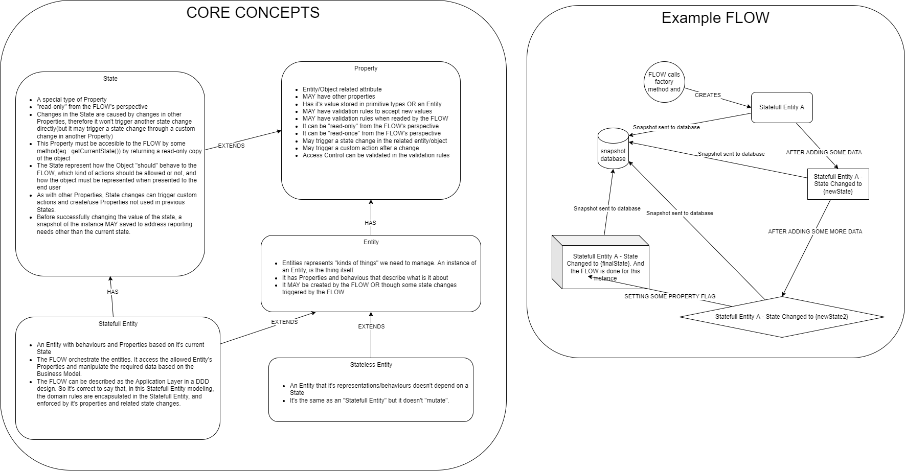

# business-core-generator

A generic state machine management library and process builder based on state machines.

The diagram below depicts the core components of the library. Despite the terms suggests an OO(Object Oriented) approach, other paradigms can be used to achieve the required levels of abstractions. 

